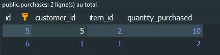
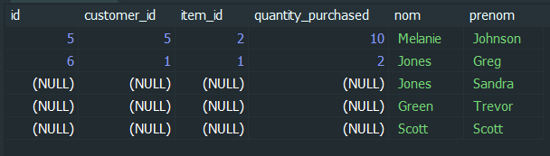
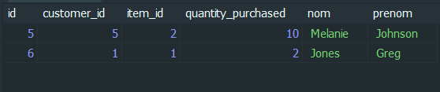

## 1. Fetch the last 2 customers in alphabetical order (A-Z) exclude ‘id’ from the results.
`SELECT last_name, first_name
	FROM customers
	ORDER BY last_name DESC
	LIMIT 2;`

## 2. Use SQL to delete all purchases made by Scott.
`DELETE FROM purchases
	WHERE purchases.customer_id = (SELECT customers.id FROM customers WHERE customers.nom = 'Scott');`

## 3. Does Scott still exist in the customers table, even though he has been deleted? Try and find him.
`SELECT * FROM customers WHERE customers.nom = 'Scott'`;

## 4. Use SQL to find all purchases. Join purchases with the customers table, 
	so that Scott’s order will appear, although instead of the customer’s 
	first and last name, you should only see empty/blank. 
	(Which kind of join should you use?).

`SELECT purchases.*, customers.nom, customers.prenom
	FROM purchases
	RIGHT JOIN customers ON customers.id = purchases.customer_id;`

## 5. Use SQL to find all purchases. Join purchases with the customers table, 
	so that Scott’s order will NOT appear. (Which kind of join should you use?)

`SELECT purchases.*, customers.nom, customers.prenom
	FROM purchases
	INNER JOIN customers ON customers.id = purchases.customer_id;`

